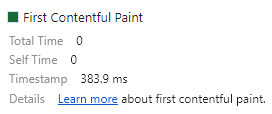
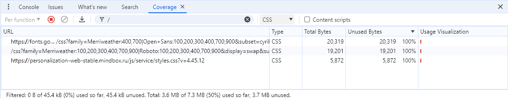

# Измерение производительности сайта Ригла

## Network

Профиль загрузки ресурсов [HAR](./sources/www.rigla.ru.har)

### Неоптимальные места:
#### 1. Дублирование ресурсов:

1.1 Повторные запросы к API: `https://www.rigla.ru/graphql`   
Вероятно, стоит их группировать в один запрос (по возможности)


1.2 Несколькими запросами получаются подтипы одного шрифта:
    `https://www.rigla.ru/fonts/MyriadPro`
    

1.3 Перезапрос шрифта Merriweather weight 400 и 700:
    

   Запросы к шрифтам могут быть оптимизированы путем объединения запросов. Или вообще подумать над тем, куда нам столько шрифтов, нужны ли они нам все?
   

1.4 Отправляется два запроса, отличающиеся лишь одним полем.    
Вероятно нам вообще не нужно делать тот запрос, что не содержит в себе поля asyncMetrics (второй):
    
    

#### 2. Лишний размер ресурса:

2.1 Размер изображений в каруселях слишком велик, картинки не оптимизированы. 
В верстке они используются в размере 150х139px, а грузятся в 810х750px 

Элементарно в карусели картинки весят по 100-300kb, а их можно оптимизировать до 30-60kb, даже не меняя формат на более современный (webp).


2.2 Грузится неиспользуемый js код   
    Получается, что на главной странице у нас грузится скрипт карты, который используется на других страницах (не на главной). Это замедляет загрузку главной страницы. Стоит отдавать эти скрипты после загрузки контента страницы или вообще грузить отдельно.
    Помимо всего прочего он еще и большого размера.
    

#### 3. Медленно загружающиеся ресурсы:   
3.1 Фрагменты js кода слишком большие. Из-за чего загружаются очень долго прежде чем мы отобразим контент для пользователя - 1,9 сек.   
Некоторые скрипты разумно разделены на чанки, но присутствуют слишком большие фрагменты, что замедляет загрузку.


3.2 Большие не оптимизированные картинки

#### 4. Ресурсы, блокирующие загрузку:
4.1 Js код, блокирующий отображение контента (скрипты карт и прочие скрипты, не относящиеся к главной странице грузятся по первому)


4.2 Загружаются изображения, которые не видны при первом открытии страницы (в каруселях и ниже на странице). Можно использовать lazy load на скролл, чтобы ускорить отображение контента для пользователя


#### 5. Что-то ещё:
5.1 не работает Back/Forward cache: на странице используется WebBluetooth API - его можно отключить


5.2 Использование устаревших форматов изображений современные форматы изображений - то есть форматы WebP и AVIF (более эффективное сжатие по сравнению с PNG/JPEG)

5.3 Большое смещение макета при загрузке контента - Можно пофиксить задав изображениям явным образом атрибуты width и height.

## Performance

Профиль загрузки [JSON](./sources/performance-trace-20240619T173131.json)

### Время в миллисекундах от начала навигации до событий

- First Paint (FP) - 383.9 ms

    
- First Contentful Paint (FCP) - 383.9 ms   

    
- DOM Content Loaded (DCL) - 638.7 ms

    
- Load - 737.1 ms

    
- Largest Contentful Paint (LCP) - 3 368.8 ms

    

<p align="center">

| Метрика                  | Время, мс |
|--------------------------|-----------|
| First Paint              | 383.9     |
| First Contentful Paint   | 383.9     |
| DCL                      | 638.7    |
| Load Event               | 737.1    |
| Largest Contentful Paint | 3368.8    |

</p>

### DOM-элемент на котором происходит LCP

```

```


### Сколько времени в миллисекундах тратится на разные этапы обработки документа

Этапы обработки документа занимают:

| Метрика    | Время, мс |
|------------|-----------|
| Loading    | 20        |
| Scripting  | 2550      |
| Rendering  | 287       |
| Painting   | 204       |


## Coverage

Профиль загрузки страницы [JSON](./sources/Coverage.json)

Скриншот вкладки после загрузки страницы:


Неиспользуемый CSS: 45.2 kB


Неиспользуемый JS: 3 686 kB


# Измерение производительности сайта с замедлением CPU 4x slowdown и эмуляцией сети Slow 3G

## Network

Профиль загрузки ресурсов [HAR](./sources/www.rigla.ru-slow.har)

### Неоптимальные места:

Неоптимальные места остались те же, только ситуация еще ухудшилась.

1. Запрос аналитики отправляется еще тогда, когда страница не загружена и блокирует загрузку необходимых ресурсов. По итогу мы ждали почти 40 секунд, но так и не получили результат. Вероятно стоит откладывать аналитические запросы на после загрузки основного контента страницы. 


2. Гигантские по размеру картинки, которые мы ждали по 10-50 секунд (!).


3. В целом очень большое количество запросов, сложное DOM-дерево, не оптимизированный контент не позволяют нам использовать сайт в условиях медленного соединения и слабого CPU.


## Performance

Профиль загрузки [JSON](./sources/performance-slow-trace-20240619T181729.json)

### Время в миллисекундах от начала навигации до событий

- First Paint (FP) - 23 671.0 ms

    
- First Contentful Paint (FCP) - 23 671.0 ms

    
- DOM Content Loaded (DCL) - 38 148.2 ms

    
- Largest Contentful Paint (LCP) - 108 693.1 ms

    
- Load - 117 525.1 ms

    

<p align="center">

| Метрика                  | Время, мс |
|--------------------------|-----------|
| First Paint              | 23 671.0  |
| First Contentful Paint   | 23 671.0  |
| DCL                      | 38 148.2  |
| Largest Contentful Paint | 108 693.1 |
| Load Event               | 117 525.1 |

</p>

### DOM-элемент на котором происходит LCP
`img.popup-metadata-type-slider__img`


### Сколько времени в миллисекундах тратится на разные этапы обработки документа

Этапы обработки документа занимают:

| Метрика    | Время, мс |
|------------|-----------|
| Loading    | 110       |
| Scripting  | 11 020    |
| Rendering  | 1 784     |
| Painting   | 2 172     |


## Coverage

Профиль загрузки страницы [JSON](./sources/Coverage-slow.json)

Скриншот вкладки после загрузки страницы


Неиспользуемый CSS: 45.4 kB


Неиспользуемый JS: 3 686 kB

